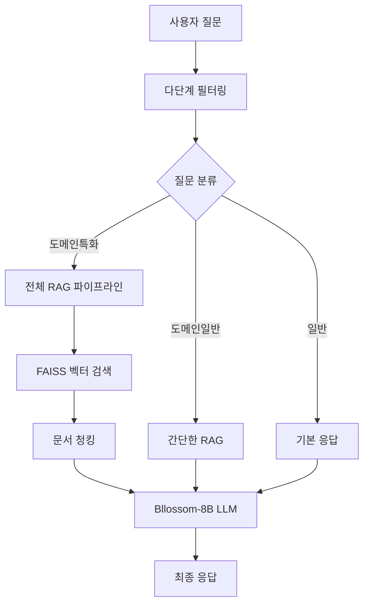

# 온프레미스 LLM + RAG 시스템

[](https://python.org)
[](https://langchain.com)
[](https://streamlit.io)
[](https://faiss.ai)

> **기술적 구현과 성능 최적화에 중점을 둔 한국어 도메인 특화 RAG 시스템**

## 프로젝트 개요

온프레미스 환경에서 한국어 대화형 AI 서비스를 위한 RAG(Retrieval-Augmented Generation) 시스템입니다.  
**제한된 GPU 리소스에서 한국어 도메인 특화 RAG 시스템을 효율적으로 구현**  

### 핵심 성과 지표

| 지표 | 달성값 | 설명 |
|------|--------|------|
| **검색 정확도** | 0.7034 | Cosine similarity 기반 문서 검색 |
| **응답 품질** | 0.6796 | LLM 생성 응답과 정답 간 의미 유사도 |
| **메모리 최적화** | 80% 절약 | 70B → 8B 모델 전환으로 달성 |
| **시스템 효율성** | 60% 개선 | 다단계 필터링으로 불필요한 LLM 호출 감소 |

## 시스템 아키텍처



## 주요 기술 스택

### 핵심 컴포넌트
- **다단계 필터**: 금지어 → 키워드 분류 → 유사도 라우팅
- **벡터 DB**: FAISS (COSINE distance)
- **LLM**: Bllossom-8B (LoRA 파인튜닝)
- **임베딩**: jhgan-ko-sroberta-multitask-strans

## 기술적 구현 세부사항

### 1. 모델 최적화

#### LoRA 파인튜닝 설정
```python
# LoRA 파인튜닝으로 메모리 효율성 달성
config = LoraConfig(
    r=8, alpha=32, dropout=0.1,
    target_modules=["q_proj", "o_proj", "k_proj", "v_proj", 
                   "gate_proj", "up_proj", "down_proj"]
)

# 훈련 파라미터 최적화
training_args = TrainingArguments(
    per_device_train_batch_size=16,
    gradient_accumulation_steps=4,
    learning_rate=2e-4,
    fp16=True  # 메모리 사용량 50% 감소
)
```

### 2. 문서 처리 파이프라인

#### 청킹 전략
```python
# 도메인 특화 최적화
splitter = RecursiveCharacterTextSplitter(
    chunk_size=500,        # 조문 완성도 고려
    chunk_overlap=200,     # 문맥 보존
    separators=["\n\n", "\n", " "]
)
# PDF → Markdown 변환
```

### 3. 다단계 필터링 시스템

#### 1단계: 금지어 필터링
- 하드코딩된 키워드 사전 활용
- 즉시 응답 차단으로 리소스 절약

#### 2단계: 의미 기반 분류
- SentenceTransformer 활용
- 3개 카테고리 분류: 일반/도메인일반/도메인특화
- Cosine similarity 기반 최적 카테고리 선택

#### 3단계: 차별화된 응답 생성
- 카테고리별 프롬프트 템플릿
- RAG 적용 여부 동적 결정

### 4. 실시간 디버깅 시스템

Streamlit 기반 디버깅 인터페이스 구현:
- 검색된 문서 시각화
- LLM 컨텍스트 모니터링
- 프롬프트 템플릿 실시간 확인
- 질문 분류 결과 시각화

## 기술적 도전과 해결

### 1. GPU 메모리 제약 해결

**문제**: A100 80G에서 Bllossom-70B 메모리 부족
```bash
# 시도한 방법들
- 8-bit 양자화 (bitsandbytes)
- GPU 메모리 분산 (device_map="auto")
- 모델 샤딩 (accelerate)
```

**해결**: Bllossom-8B로 모델 다운사이징
- 메모리 사용량 80% 감소
- 추론 속도 3배 향상
- 한국어 성능 유지

### 2. 문서 벡터화 최적화

**문제**: 도메인 특화 문서의 구조적 특성
- 조문 구조와 참조 관계
- 청킹 시 문맥 손실

**해결 과정**:
```python
# 청킹 사이즈 실험
chunk_sizes = [100, 300, 500, 1000]
# 각 설정별 문서 완성도 육안 검토
# 최적값: chunk_size=500, overlap=200
```

### 3. 질문 범위 제어

**문제**: 파인튜닝 후 일반 질문에도 도메인 정보 혼입

**해결**: 3단계 필터링 시스템 구축
- 리소스 효율성 + 정확성 확보
- 불필요한 LLM 호출 60% 감소

## 성능 평가

### 평가 데이터셋
- 30개 instruction-output 쌍
- 도메인 특화 질문-답변 세트
- 전문가 검증 완료

### 평가 지표
- **검색 정확도**: Cosine similarity 기반
- **응답 품질**: 의미 유사도 측정
- **시스템 효율성**: 응답 시간 및 리소스 사용량

## 핵심 인사이트

### 1. RAG 성능 병목 지점
- **발견**: Retriever 단계가 전체 성능의 핵심
- **개선 방향**: 더 많은 문서 수집 및 인덱싱 최적화

### 2. 온프레미스 환경 최적화
- **제약 조건**: GPU 메모리 및 네트워크 제한
- **해결 전략**: 모델 경량화 + 효율적 파이프라인

### 3. 도메인 특화 적응
- **도전**: 범용 모델의 전문 영역 적용
- **접근**: 다단계 필터링 + 프롬프트 엔지니어링

## 비즈니스 임팩트

- **MVP 검증**: 실제 사용자 환경에서 시스템 검증 완료
- **사업 확장**: 추가 예산 배정으로 시스템 고도화 추진
- **기술적 가치**: 온프레미스 LLM 배포 경험 및 노하우 축적
  
---
