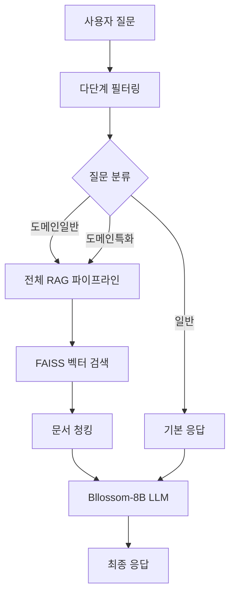

# 온프레미스 LLM + RAG 서비스

[](https://python.org)
[](https://langchain.com)
[](https://streamlit.io)
[](https://faiss.ai)

> **제한된 GPU 리소스에서 한국어 도메인 특화 RAG 시스템을 효율적으로 구현**

## 프로젝트 개요

온프레미스 환경에서 한국어 도메인 특화 문서 기반 질의응답 시스템입니다.  
`A100 80GB` 서버의 메모리 제약 하에서 **대용량 LLM 배포 문제를 해결**하고, **다단계 필터링**을 통한 효율적인 RAG 파이프라인을 구축했습니다.

### 핵심 성과 지표

| 지표 | 달성값 | 설명 |
|------|--------|------|
| **검색 정확도** | 0.7034 | Cosine similarity 기반 문서 검색 |
| **응답 품질** | 0.6796 | LLM 생성 응답과 정답 간 의미 유사도 |
| **메모리 최적화** | 약 80% 절약 | 70B → 8B 모델 전환으로 달성 (파라미터 추정치) |

## 시스템 아키텍처



## 주요 기술 스택

### 핵심 컴포넌트

| 컴포넌트 |  설명 |
|------|------|
| **다단계 필터** | 금지어 → 키워드 분류 → 유사도 라우팅 |
| **벡터 DB** | FAISS (COSINE distance) |
| **LLM** | Bllossom-8B (LoRA 파인튜닝) |
| **임베딩** | jhgan-ko-sroberta-multitask-strans |

## 기술적 구현 세부사항

### 1. 대용량 모델 배포 문제 해결

#### 메모리 제약 극복 과정
```bash
# 시도한 최적화 방법들
1. 8-bit 양자화 (bitsandbytes) → CUDA OOM 지속
2. GPU 메모리 분산 (device_map="auto") → 로딩 실패  
3. 모델 샤딩 (accelerate) → 메모리 부족
4. 최종 해결: 70B → 8B 모델 전환
```

#### vLLM 서빙 최적화
```bash
gpu_memory_utilization=0.4  # 안정적 메모리 사용
enforce_eager=True          # Streamlit 동기 처리 최적화
max_model_len=2048          # VRAM 효율적 활용
```

### 2. 다단계 필터링 시스템

#### 3단계 필터링 구조
1. **금지어 필터링**: 키워드 사전 매칭으로 즉시 차단
2. **질문 분류**: 
   - 키워드 기반 1차 분류
   - SentenceTransformer 기반 2차 분류 (90개 질문 사전 활용)
3. **차별화된 처리**: 카테고리별 프롬프트 템플릿 적용

#### 분류 카테고리
- **일반**: 인삿말, 일상 대화 → 기본 응답
- **도메인일반**: 기본 개념, 용어 → 간소화된 RAG
- **도메인특화**: 전문 정보, 세부 규정 → 전체 RAG 파이프라인


### 3. RAG 파이프라인 최적화

#### 문서 처리 최적화
```python
# 청킹 전략 최적화
chunk_size=500     # 완성도 고려한 최적값
chunk_overlap=200  # 문맥 보존
separators=["\n\n", "\n", " "]
```

#### 검색 성능 향상
- **pymupdf4llm**: PDF → Markdown 변환으로 구조 보존
- **FAISS COSINE**: 한국어 임베딩에 최적화된 유사도 계산
- **top-k=3**: 검색 정확도와 응답 시간 균형

### 4. LoRA 파인튜닝 최적화

#### 메모리 효율적 파인튜닝

```bash
r=8, alpha=32    # 성능과 메모리 사용량 균형
target_modules   # 어텐션 + MLP 레이어 모두 적용
fp16=True        # 메모리 사용량 50% 감소
max_steps=300    # 과적합 방지
```
  
### 1. 모델 최적화

#### LoRA 파인튜닝 설정
```python
# LoRA 파인튜닝으로 메모리 효율성 달성
config = LoraConfig(
    r=8, alpha=32, dropout=0.1,
    target_modules=["q_proj", "o_proj", "k_proj", "v_proj", 
                   "gate_proj", "up_proj", "down_proj"]
)

# 훈련 파라미터 최적화
training_args = TrainingArguments(
    per_device_train_batch_size=16,
    gradient_accumulation_steps=4,
    learning_rate=2e-4,
    fp16=True  # 메모리 사용량 50% 감소
)
```

### 2. 문서 처리 파이프라인

#### 청킹 전략
```python
# 도메인 특화 최적화
splitter = RecursiveCharacterTextSplitter(
    chunk_size=500,        # 조문 완성도 고려
    chunk_overlap=200,     # 문맥 보존
    separators=["\n\n", "\n", " "]
)
# PDF → Markdown 변환
```

### 3. 다단계 필터링 시스템

#### 1단계: 금지어 필터링
- 하드코딩된 키워드 사전 활용
- 즉시 응답 차단으로 리소스 절약

#### 2단계: 의미 기반 분류
- SentenceTransformer 활용
- 3개 카테고리 분류: 일반/도메인일반/도메인특화
- Cosine similarity 기반 최적 카테고리 선택

#### 3단계: 차별화된 응답 생성
- 카테고리별 프롬프트 템플릿
- RAG 적용 여부 동적 결정

### 4. 실시간 디버깅 시스템

Streamlit 기반 디버깅 인터페이스 구현:
- 검색된 문서 시각화
- LLM 컨텍스트 모니터링
- 프롬프트 템플릿 실시간 확인
- 질문 분류 결과 시각화

## 기술적 도전과 해결

### 1. GPU 메모리 제약 해결

> [!WARNING]
> A100 80GB 서버에서도 Bllossom-70B 모델은 메모리 할당 제한으로 실제 사용 가능한 메모리가 ~20GB 수준으로 제한됨

**해결 과정**:  
- 외부 네트워크 제한 → USB 물리적 전송으로 모델 배포
- 다양한 양자화 기법 시도 → 모든 방법 실패
- **최종 해결**: 8B 모델 전환으로 근본적 해결

**시도한 최적화 방법들:**  
- 8-bit 양자화 (bitsandbytes) → CUDA OOM 지속
- GPU 메모리 분산 (device_map="auto") → 로딩 실패  
- 모델 샤딩 (accelerate) → 메모리 부족

> [!TIP]
> 온프레미스 환경에서 대용량 모델 배포 시 **모델 다운사이징**이 양자화보다 더 효과적일 수 있음


### 2. 질문 범위 제어

> [!Warning]
> 파인튜닝 후 일반 질문에도 도메인 정보가 혼입되는 현상 발생 - 3단계 필터링 시스템으로 해결

**해결**: 3단계 필터링 시스템 구축  

- 리소스 효율성 + 정확성 확보
- 불필요한 RAG 연산 대폭 감소
- 카테고리별 최적화된 응답 생성


### 3. 문서 벡터화 최적화

> [!Warning]
> 도메인 특화 문서의 구조와 참조 관계

**해결**: 체계적 실험을 통한 최적 설정 도출  

- chunk_size 실험: 100, 300, 500, 1000
- 처리 방식 비교: PDF OCR, 직접 처리, Markdown 변환
- 육안 검토를 통한 조문 완성도 검증


## 성능 평가

### 평가 환경

- **데이터셋**: 30개 도메인 특화 instruction-output 쌍
- **평가 방법**: 전문가 검증 완료된 질문-답변 세트
- **측정 지표**: 검색 정확도, 응답 품질, 시스템 효율성

### 병목 지점 분석
- **발견**: Retriever 단계가 전체 성능의 핵심 결정 요소
- **개선 방향**: 문서 수집 확대 및 인덱싱 최적화 필요

## 실시간 디버깅 시스템

### 구현 기능
- **질문 분류 결과**: 카테고리별 유사도 시각화
- **검색 문서**: TOP-3 검색 결과 및 유사도 점수
- **LLM 컨텍스트**: 실제 입력된 컨텍스트 내용
- **프롬프트 템플릿**: 카테고리별 사용된 프롬프트
- **응답 생성**: 최종 출력 결과

### 개발 효율성
- 실시간 성능 모니터링
- 파라미터 튜닝 지원
- 오류 분석 및 디버깅 최적화

## 핵심 인사이트

### 1. 제약 조건 하에서의 최적화

- **메모리 제약**: 모델 다운사이징을 통한 근본적 해결
- **네트워크 제약**: 물리적 전송으로 배포 문제 해결
- **성능 제약**: 다단계 필터링으로 효율성 극대화

### 2. RAG 시스템 설계 원칙

- **Retriever 우선**: 검색 품질이 전체 성능의 핵심
- **문서 구조 보존**: 도메인 특화 문서의 구조적 특성 고려
- **단계별 최적화**: 각 파이프라인 단계별 개별 최적화

### 3. 온프레미스 환경 적응

- **독립적 운영**: 외부 의존성 최소화
- **리소스 효율성**: 제한된 자원에서 최대 성능 달성
- **안정성 우선**: 24시간 운영 가능한 견고한 시스템

## 비즈니스 임팩트

> [!NOTE]
> **MVP 검증**: 실제 사용자 환경에서 시스템 검증 완료


